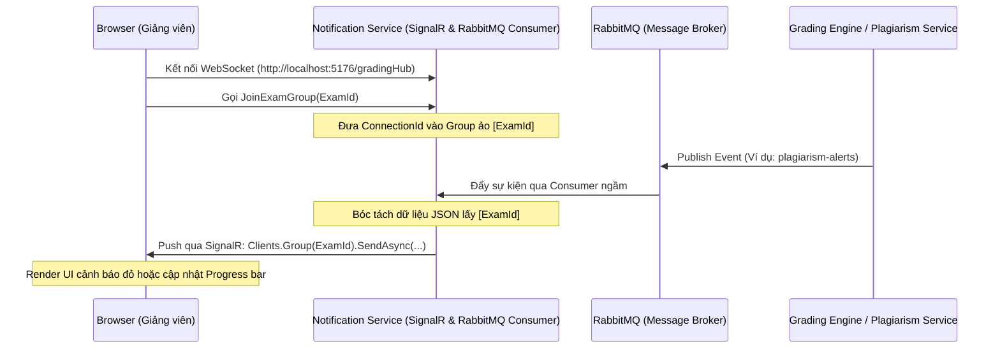

# Tài liệu Thiết kế & Tích hợp Real-time Notification Service

Tài liệu này mô tả chi tiết kiến trúc, cấu trúc luồng tin và cách tích hợp của dịch vụ **Notification & Real-time Service** (thuộc cổng dịch vụ hỗ trợ chấm thi thực hành PRN232).

---

## 1. Tổng quan dịch vụ (Overview)

**Notification Service** là một dịch vụ trung chuyển tin nhắn thời gian thực (Stateless Real-time Message Router). Nhiệm vụ cốt lõi của dịch vụ là:
1. **Lắng nghe sự kiện (Event Consumer)**: Đọc liên tục các cập nhật tiến trình chấm bài và cảnh báo gian lận từ Message Broker (**RabbitMQ**).
2. **Định tuyến & Gom nhóm (Grouping & Routing)**: Bóc tách mã phòng thi (`ExamId`) để gom nhóm kết nối của Giảng viên giám thị đúng phòng thi.
3. **Chuyển tiếp thời gian thực (WebSocket Push)**: Đẩy gói tin lập tức tới trình duyệt của Giảng viên thông qua kênh **SignalR Hub**, giúp giám sát tiến trình thi mà không cần tải lại trang.

Dịch vụ này được xây dựng độc lập theo mô hình **Stateless (Không lưu trạng thái)** nhằm tối ưu hiệu năng và dễ dàng mở rộng (scale-out).

---

## 2. Sơ đồ Kiến trúc & Luồng dữ liệu (Architecture Flow)

Dưới đây là mô hình truyền tin Event-Driven giữa các Service và Client:



---

## 3. Chi tiết Cấu hình Hàng đợi (RabbitMQ Queues)

Dịch vụ lắng nghe cùng lúc 3 hàng đợi trung tâm từ RabbitMQ:

| Tên Hàng Đợi (Queue) | Nguồn Phát (Publisher) | Sự Kiện (Event) | Phương thức SignalR tương ứng |
| :--- | :--- | :--- | :--- |
| **`grading-jobs`** | Exam Account Service | Bắt đầu nhận bài nộp chấm | `UpdateProgress` |
| **`grading-results`** | Grading Engine | Tiến trình chấm chạy qua các Test Case | `UpdateProgress` |
| **`plagiarism-alerts`** | Plagiarism Service | Phát hiện bài thi vi phạm từ cấm / chép code | `PlagiarismAlert` |

---

## 4. Chi tiết Thiết kế Mã nguồn (Implementation Details)

### 4.1. SignalR Hub: `GradingHub.cs`
Hub quản lý kết nối thời gian thực và gom nhóm kết nối của giảng viên theo phòng thi để tránh gửi nhầm dữ liệu sang các phòng thi khác:
* **Hàm `JoinExamGroup(string examId)`**: Đưa kết nối hiện tại vào nhóm WebSocket của kỳ thi tương ứng.
* **Hàm `LeaveExamGroup(string examId)`**: Loại kết nối ra khỏi nhóm khi rời màn hình giám sát.

### 4.2. Consumer phân phối trung tâm: `NotificationIntegrationConsumer.cs`
Là một `BackgroundService` chạy ngầm, thực hiện kết nối liên tục với RabbitMQ:
* **Thuật toán phân tích JSON động**: Nhận payload dạng chuỗi và dùng `JsonDocument` để trích xuất trường `ExamId` (không phân biệt hoa/thường `ExamId` hay `examId`).
* **Định tuyến động**: Gọi `_hubContext.Clients.Group(examId).SendAsync(...)` để đẩy trực tiếp dữ liệu xuống Client.

### 4.3. Cấu hình CORS và Cổng mạng (`Program.cs`)
* Chạy cục bộ trên cổng **`5176`**.
* Cấu hình **CORS Policy** đặc biệt để cho phép Frontend (mặc định Vite chạy ở cổng `5173`) thiết lập kết nối WebSocket có kèm thông tin định danh:
  ```csharp
  policy.WithOrigins("http://localhost:5173")
        .AllowAnyHeader()
        .AllowAnyMethod()
        .AllowCredentials(); // Bắt buộc đối với SignalR WebSockets
  ```

---

## 5. Hướng dẫn Kiểm thử Cục bộ (Testing Guide)

Bạn có thể dễ dàng kiểm thử luồng hoạt động bằng cách giả lập tin nhắn trực tiếp qua giao diện quản trị của RabbitMQ:

1. **Khởi chạy hệ thống**: Chạy `run_local.bat` để bật toàn bộ các APIs.
2. **Kết nối RabbitMQ**: Mở `http://localhost:15672` (Tài khoản: `guest` / `guest`).
3. **Gửi tin nhắn giả lập**:
   * Truy cập tab **Queues** -> Click chọn queue `plagiarism-alerts`.
   * Tại mục **Publish message**, dán gói tin mẫu:
     ```json
     {
       "ExamId": "550e8400-e29b-41d4-a716-446655440000",
       "SubmissionId": "d48590cb-2292-4d7a-8f1d-8cb5d5a712e3",
       "StudentId": "SE182004",
       "Violations": [
         {
           "FileName": "MyDbContext.cs",
           "BannedKeyword": "optionsBuilder",
           "LineNumber": 11,
           "CodeSnippet": "optionsBuilder.UseSqlServer(...)"
         }
       ]
     }
     ```
   * Bấm **Publish message**.
4. **Kiểm tra Log**:
   Xem log trên terminal của **Notification Service**, log in ra:
   `--> Forwarded message to SignalR group 550e8400-e29b-41d4-a716-446655440000 via method PlagiarismAlert` chứng tỏ hệ thống đã trung chuyển thành công!
