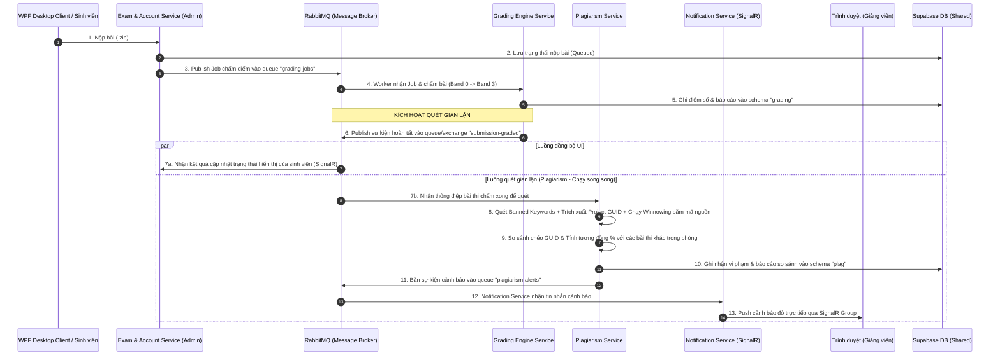

# Hướng dẫn Tích hợp Luồng Quét Gian Lận (Plagiarism Service Integration Flow)

Tài liệu này mô tả chi tiết luồng xử lý (flow), cấu trúc thông điệp (event payload) và hợp đồng tích hợp giữa **Exam Account Service**, **Grading Engine** và **Plagiarism Service** để thực hiện quét gian lận (bắt từ khóa cấm) tự động ngay khi chấm điểm xong.

---

## 1. Sơ đồ Kiến trúc luồng Tích hợp (Sequence Flow)

Sơ đồ dưới đây biểu diễn cách các dịch vụ giao tiếp thông qua **RabbitMQ (Message Broker)** và **SignalR (WebSockets)**:



---

## 2. Hợp đồng Tích hợp Sự kiện (RabbitMQ Message Contract)

Sau khi **Grading Engine** chấm bài thi thành công, nó **BẮT BUỘC** phải phát đi một thông điệp (event) lên RabbitMQ. 

### 2.1 Cấu hình hàng đợi (Queue Configuration)
* **Exchange Name**: `grading.exchange` (hoặc exchange chung của hệ thống)
* **Queue Name**: `submission-graded`
* **Routing Key**: `submission.graded` (hoặc bind trực tiếp vào queue `submission-graded`)
* **Durable**: `true`

### 2.2 Cấu trúc JSON Payload (`SubmissionGradedEvent`)
Grading Engine cần serialize dữ liệu thành chuỗi JSON dạng UTF-8 byte array và publish lên queue với cấu trúc sau:

```json
{
  "SubmissionId": "d48590cb-2292-4d7a-8f1d-8cb5d5a712e3",
  "ExamId": "550e8400-e29b-41d4-a716-446655440000",
  "StudentId": "SE182004",
  "WorkspacePath": "D:\\Project_PRN\\System_Repo\\All Engine\\Engine_Service\\sample-student-submission\\d48590cb-2292-4d7a-8f1d-8cb5d5a712e3",
  "BannedKeywords": [
    "Process",
    "Registry",
    "DllImport",
    "Socket"
  ]
}
```

#### Giải thích các trường dữ liệu:
1. **`SubmissionId`** *(Guid)*: ID duy nhất của bài nộp (cần khớp với ID trong schema `exam` và `grading`).
2. **`ExamId`** *(Guid)*: ID của kỳ thi chứa bài làm.
3. **`StudentId`** *(String)*: Mã số sinh viên (ví dụ: `SE182004`).
4. **`WorkspacePath`** *(String)*: Đường dẫn tuyệt đối đến thư mục chứa mã nguồn đã giải nén của sinh viên trên server local để Plagiarism thực hiện quét file.
5. **`BannedKeywords`** *(List<String>)*: Danh sách các từ khóa cấm/gian lận được cấu hình trong rubric của kỳ thi đó (ví dụ: cấm dùng `Process.Start` gọi app ngoài, cấm dùng `Registry` sửa hệ thống).

---

## 3. Phía Plagiarism Service sẽ xử lý như thế nào?

Khi nhận được thông điệp trên, **Plagiarism Service** sẽ tự động thực hiện các bước sau:

1. **Tìm kiếm các file source code**: Tìm tất cả các file có đuôi `.cs` trong đường dẫn `WorkspacePath` (bỏ qua các thư mục sinh tự động như `bin/`, `obj/`, `Migrations/`).
2. **Phân tích cú pháp Roslyn**: Đọc từng file và xây dựng cây cú pháp AST (Abstract Syntax Tree).
3. **Đối chiếu từ khóa cấm**: Tìm các khai báo định danh (Identifiers) khớp với danh sách `BannedKeywords`.
4. **Lưu trữ kết quả**:
   * Ghi kết quả vào schema **`plag`** trên database.
   * Nếu có vi phạm, thuộc tính `HasViolations` sẽ là `true` và lưu trữ chi tiết các vi phạm (tên file, số dòng, đoạn code vi phạm cụ thể).
   * Mẫu cấu trúc dữ liệu lưu trong DB:
     ```json
     {
       "id": "7055776a-5242-487c-8fc5-3c71be0eeac5",
       "submissionId": "d48590cb-2292-4d7a-8f1d-8cb5d5a712e3",
       "examId": "550e8400-e29b-41d4-a716-446655440000",
       "studentId": "SE182004",
       "hasViolations": true,
       "violations": [
         {
           "fileName": "MyDbContext.cs",
           "bannedKeyword": "optionsBuilder",
           "lineNumber": 11,
           "codeSnippet": "protected override void OnConfiguring(DbContextOptionsBuilder optionsBuilder)"
         }
       ]
     }
     ```

---

## 4. Tích hợp trực tiếp qua HTTP REST API (Dự phòng)

Trong trường hợp RabbitMQ gặp sự cố hoặc muốn kích hoạt quét thủ công không qua Broker, **Exam Account Service** hoặc các service khác có thể gọi trực tiếp API HTTP POST của Plagiarism:

* **Endpoint**: `POST http://localhost:5175/api/Plagiarism/check`
* **Content-Type**: `application/json`
* **Request Body**:
  ```json
  {
    "submissionId": "d48590cb-2292-4d7a-8f1d-8cb5d5a712e3",
    "examId": "550e8400-e29b-41d4-a716-446655440000",
    "studentId": "SE182004",
    "workspacePath": "D:\\Path\\To\\Submission",
    "bannedKeywords": ["Process", "Registry"]
  }
  ```
* **Lấy kết quả báo cáo**:
  `GET http://localhost:5175/api/Plagiarism/submissions/{submissionId}`
