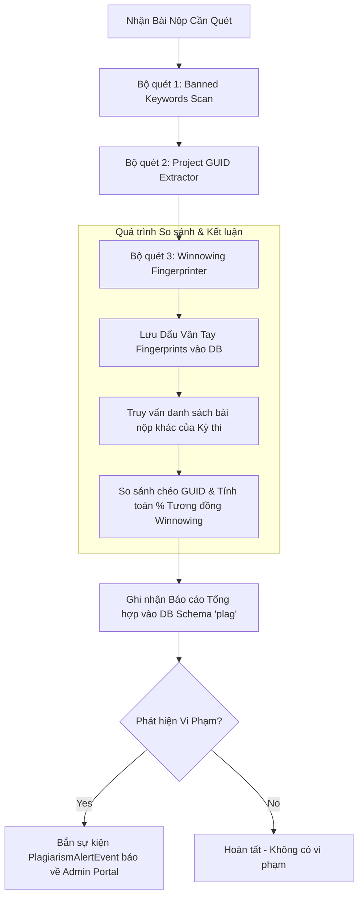

# Kế hoạch Triển khai Hệ thống Quét Gian Lận Toàn diện (Unified Plagiarism Pipeline)

> [!NOTE]
> **TRẠNG THÁI**: Đã triển khai thành công 100% các bộ quét (Banned Keywords, Project GUID, Winnowing Similarity) và tích hợp liên thông với hệ thống Real-time Notification Service.

Tài liệu này phác thảo kế hoạch triển khai kết hợp cả 3 lớp bảo vệ chống gian lận trong kỳ thi **PRN (FPT University)** vào cùng một đường ống xử lý (Pipeline) của **Plagiarism Service**:
1. **Lớp 1 - Quét Từ khóa Cấm (Banned Keywords)**: Phát hiện sử dụng API hệ thống độc hại/không được phép (Đang hoạt động).
2. **Lớp 2 - Kiểm tra GUID Dự án (Project GUID Collision)**: Phát hiện sao chép/chuyển giao nguyên thư mục code gốc (C#).
3. **Lớp 3 - Thuật toán Winnowing (Code Similarity)**: Phát hiện sao chép logic code chéo giữa các sinh viên (đổi tên biến, đổi cấu trúc đối phó).

---

## 1. Sơ đồ Pipeline xử lý khi có bài nộp mới (Unified Pipeline Flow)

Khi Plagiarism Service nhận được sự kiện `SubmissionGradedEvent` (hoặc REST API check), nó sẽ chạy tuần tự qua các bộ quét (Scanners):

---

## 2. Chi tiết Kỹ thuật của từng Bộ quét (Pipeline Components)

### Bộ quét 1: Quét Từ khóa Cấm (Banned Keywords Scanner) — *Đã có sẵn*
* **Mục tiêu**: Phát hiện gọi lệnh ngoài qua `Process.Start`, can thiệp hệ thống qua `Registry` hoặc gọi thư viện C++ qua `DllImport`.
* **Nguyên lý**: Dùng Roslyn AST để duyệt qua các node chỉ thị `using` và các nút tên biến/hàm/lớp (`IdentifierName`). Nếu phát hiện trùng với từ khóa cấm, ghi nhận vi phạm (Tên file, dòng vi phạm, đoạn code).

### Bộ quét 2: Kiểm tra Trùng GUID Dự án (Project GUID Check) — *Mới đề xuất*
* **Mục tiêu**: Phát hiện sinh viên copy nguyên thư mục dự án của nhau.
* **Nguyên lý**: 
  1. Sử dụng thư viện đọc file để quét các file `.csproj` và `.sln` trong thư mục bài làm.
  2. Dùng Regex để lọc ra chuỗi mã GUID của project (được sinh ngẫu nhiên khi tạo dự án trên Visual Studio).
  3. So sánh chéo mã GUID này với toàn bộ các mã GUID đã lưu của các bài thi khác thuộc **cùng kỳ thi (ExamId)**.
  4. Nếu trùng nhau: Gắn cờ vi phạm **"Trùng GUID dự án - Copy nguyên thư mục gốc"**.

### Bộ quét 3: So sánh Tương đồng cấu trúc Code (Winnowing Similarity) — *Mới đề xuất*
* **Mục tiêu**: Phát hiện sao chép code chéo giữa các sinh viên kể cả khi đã sửa tên biến, đổi vị trí code đối phó.
* **Nguyên lý**:
  1. **Chuẩn hóa (Normalization)**: Đọc file `.cs`, loại bỏ khoảng trắng, comment, xuống dòng. Chuyển tất cả tên biến/hàm/class thành ký tự đại diện `V`.
  2. **K-grams & Hashing**: Cắt mã nguồn thành các cụm ký tự độ dài $K$ liên tiếp, băm các cụm này thành danh sách mã số (Hash list).
  3. **Winnowing**: Dùng cửa sổ trượt kích thước $W$ đi qua danh sách mã Hash, chọn mã Hash nhỏ nhất tại mỗi cửa sổ để làm "Dấu vân tay" (Fingerprints) đại diện cho file code.
  4. **So sánh chéo & Đánh giá với Ngưỡng động**: Tính toán tỷ lệ trùng lặp dấu vân tay giữa Bài mới nộp với toàn bộ các bài thi khác trong DB của kỳ thi đó:
     $$\text{Tỷ lệ tương đồng} = \frac{\text{Số vân tay trùng nhau}}{\text{Tổng số vân tay của 2 bài}} \times 100\%$$
  5. **Cấu hình Ngưỡng động (Dynamic Threshold)**: Không sử dụng một ngưỡng cố định. Điểm tương đồng được đối chiếu với tham số `PlagiarismThreshold` (đặt động theo từng kỳ thi, mặc định `80%`), giúp Giảng viên linh hoạt kiểm soát tùy theo độ dài đề thi.

---

## 3. Thiết kế Cấu trúc Dữ liệu Schema `plag` sau khi nâng cấp

Để tích hợp cả 3 bộ quét, cấu trúc database của Plagiarism Service sẽ được thiết kế lại như sau:

### 3.1 Bảng `PlagiarismRecords` (Báo cáo của từng cá nhân)
Bảng này lưu kết quả quét từ khóa cấm và thông tin GUID của riêng học sinh đó.
* **`Id`** *(Guid, PK)*: Mã báo cáo.
* **`SubmissionId`** *(Guid)*: Liên kết tới bài nộp.
* **`ExamId`** *(Guid)*: Mã kỳ thi.
* **`StudentId`** *(Varchar)*: Mã sinh viên.
* **`ProjectGuids`** *(Text[])*: Mảng chứa các mã GUID trích xuất được từ các file project của sinh viên này.
* **`HasViolations`** *(Boolean)*: Đánh dấu có vi phạm từ khóa cấm hay không.
* **`ScannedAt`** *(Timestamp)*: Thời gian quét.

### 3.2 Bảng `PlagiarismViolationRecords` (Chi tiết lỗi từ khóa cấm)
* **`Id`** *(Guid, PK)*: Mã chi tiết.
* **`PlagiarismRecordId`** *(Guid, FK)*: Liên kết tới bảng `PlagiarismRecords`.
* **`FileName`** *(Varchar)*: File chứa từ khóa cấm.
* **`BannedKeyword`** *(Varchar)*: Từ khóa cấm bị phát hiện.
* **`LineNumber`** *(Int)*: Số dòng vi phạm.
* **`CodeSnippet`** *(Text)*: Đoạn code vi phạm thực tế.

### 3.3 Bảng `PlagiarismComparisons` (Báo cáo so sánh trùng lặp chéo giữa các cặp bài thi)
Bảng này dùng để lưu kết quả so sánh tương đồng và trùng GUID chéo giữa các học sinh.
* **`Id`** *(Guid, PK)*: Mã so sánh.
* **`ExamId`** *(Guid)*: Mã kỳ thi để lọc báo cáo.
* **`SubmissionIdA`** *(Guid)*: Bài nộp của học sinh A.
* **`SubmissionIdB`** *(Guid)*: Bài nộp của học sinh B.
* **`StudentIdA`** *(Varchar)*: Mã học sinh A.
* **`StudentIdB`** *(Varchar)*: Mã học sinh B.
* **`SimilarityScore`** *(Numeric)*: Điểm tương đồng Winnowing (ví dụ: 0.85 tức là giống nhau 85%).
* **`GuidMatched`** *(Boolean)*: Đánh dấu có bị trùng mã GUID project (sao chép thư mục) hay không.
* **`ScannedAt`** *(Timestamp)*: Thời gian thực hiện so sánh chéo.

---

## 4. Cơ chế Giảm thiểu Bắt Sai (False Positives)

Vì đề thi thực hành PRN của Đại học FPT có đặc thù nghiệp vụ rất giống nhau (CRUD, Entity Framework Core), cấu trúc bài làm của các sinh viên tự viết trung thực vẫn có thể giống nhau từ 50% - 70%. Hệ thống áp dụng các giải pháp sau để giảm tối đa tỉ lệ bắt sai:

1. **Ngưỡng Cảnh Báo Linh Hoạt (Dynamic Threshold)**: 
   - Đặt ngưỡng mặc định cao (ví dụ `80% - 85%`). Các bài thi tự làm trùng lặp ngẫu nhiên ở phần cấu hình/boilerplate sẽ có điểm tương đồng thấp hơn ngưỡng này và không bị cảnh báo.
   - Giảng viên có quyền điều chỉnh ngưỡng này trực tiếp từ Admin Portal cho từng kỳ thi cụ thể.
2. **Đối chiếu Tuyệt đối với Project GUID**:
   - Trường hợp bài thi bị trùng mã GUID của file `.csproj`/`.sln` chéo nhau, hệ thống sẽ kết luận trực tiếp hành vi sao chép thư mục và gắn cờ cảnh báo Đỏ, không phụ thuộc vào tỉ lệ % tương đồng của Winnowing.
3. **Lọc Dấu Vân Tay Bài Mẫu (Template Filtering - Định hướng tương lai)**:
   - Cho phép nhập dự án mẫu (Skeleton) do giảng viên cung cấp và lọc bỏ hoàn toàn các dấu vân tay của dự án mẫu này trước khi tính điểm tương đồng giữa các sinh viên.

---

## 5. Kịch bản Vận hành & Tích hợp trên Frontend (Admin Portal)

Khi Giảng viên vào trang quản trị kỳ thi trên Web Admin Portal:
1. **Xem Báo cáo Tổng quan**: Hiện danh sách sinh viên vi phạm Từ khóa cấm (Banned Keywords) từ bảng `PlagiarismRecords`.
2. **Xem Bảng xếp hạng Nghi vấn Sao chép**: Danh sách các cặp sinh viên có độ tương đồng cấu trúc cao hoặc trùng GUID dự án từ bảng `PlagiarismComparisons` được xếp hạng từ cao xuống thấp (ví dụ: Cặp A - B giống nhau 92% xếp đầu tiên).
3. **Xem so sánh trực quan (Diff View)**: Cho phép click vào cặp nghi vấn để hiển thị side-by-side (2 màn hình song song) tô đỏ các phần code giống nhau của học sinh A và học sinh B để giảng viên quyết định trừ điểm.
